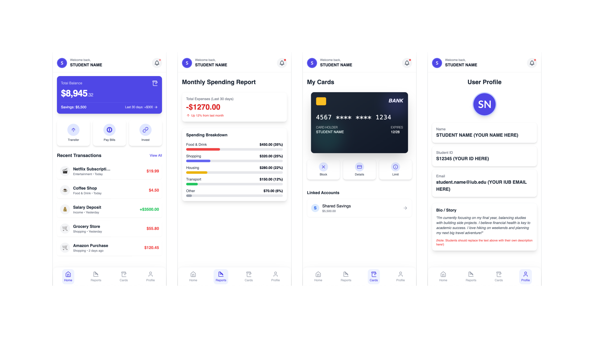

# Assignment 2 - Flutter UI

## Student Information
- **Name:** Faysal Jamil Rifat Durlov
- **Student ID:** 2321142
- **Course:** Mobile Application Development
- **Assignment:** Flutter UI Development

## Project Overview

This project is a Flutter-based mobile banking application UI that demonstrates modern mobile app design principles. The application includes three main pages with seamless navigation and responsive design.

## Task Requirements

### Pages:
1. **Page 1 (Home/Dashboard)** - Main dashboard with balance card, transaction history, and quick actions
2. **Cards Page** - Credit card display with actions and linked accounts (Additional page)
3. **Page 4 (Profile)** - User profile with personal information and bio section  


## Screenshots & Demo

### Task Reference



## Installation & Setup

### Prerequisites
- Flutter SDK (latest stable)
- Android Studio / VS Code
- Android device or emulator

### Running the App
```bash
# Clone the repository
git clone https://github.com/FaysalDurlov/assignment-two-flutter_UI-Faysal_Jamil_Rifat_Durlov-2321142.git

# Navigate to project directory
cd assignment_2_ui_development

# Get dependencies
flutter pub get

# Run the app
flutter run
```